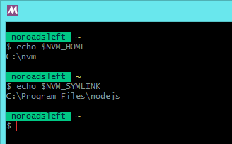
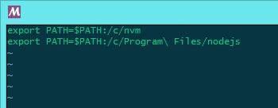
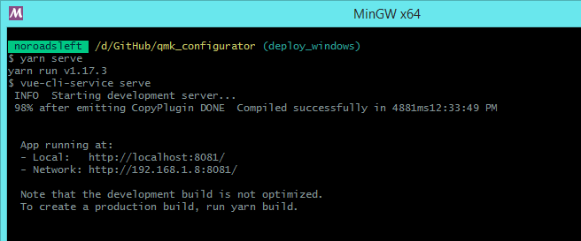

# Deploy a Local Instance of QMK Configurator on Windows

Windows users who wish to deploy a local instance QMK Configurator can do so using either Windows Command Prompt/Powershell or an MSYS2 or MinGW terminal.

- [Instructions for Windows Command Prompt/Powershell](#install-for-windows-command-promptpowershell)
- [Instructions for MSYS2 or MinGW](#install-for-msys2-or-mingw)
- [Deploy the QMK Configurator](#deploy-the-qmk-configurator)

----

## Install for Windows Command Prompt/Powershell

### Installation and Configuration

1. Download the latest `nvm-setup.zip` for [nvm-windows] and extract it.
2. Run the `nvm-setup.exe` therein, and follow the prompts.
3. Open a Command Prompt window and install the desired version(s) of Node.js using `nvm install <version>`.
   - QMK Configurator's required version of Node.js will be defined in the `.nvmrc` file in the root directory of the `qmk_configurator` repository.
4. Configure the desired Node.js version using `nvm use <version>`.
5. Install Yarn using `npm i -g yarn`.
6. [Deploy the QMK Configurator.]

----

## Install for MSYS2 or MinGW

### Installation and Configuration

1. Download the latest `nvm-setup.zip` for [nvm-windows] and extract it.
2. Run the `nvm-setup.exe` therein, and follow the prompts.
   - **For the nvm installation folder, choose a path that does not contain any spaces.**
3. Open an MSYS2 or MinGW shell terminal.
3. Echo `$NVM_HOME` and `$NVM_SYMLINK` to your terminal.  
   
4. Add the necessary paths to your environment.
   1. Open the `~/.bashrc` file in the text editor of your choice.
   2. Add the paths given by `$NVM_HOME` and `$NVM_SYMLINK` as exports, changing the paths from Windows format to Linux format.
      - Drive letters `C:` should be changed to `/c/`.
      - Change any backslashes `\` to forward slashes `/`.
      - Put a backslash before any spaces.  
      
   3. Save and close the file.
   4. Run `source ~/.bashrc` so MSYS2/MinGW picks up the now-added variables.
5. Install the desired version(s) of Node.js using `nvm install <version>`.
   - QMK Configurator's required version of Node.js will be defined in the `.nvmrc` file in the root directory of the `qmk_configurator` repository.
6. Configure the desired Node.js version using `nvm use <version>`.
7. Install Yarn using `npm i -g yarn`.
8. [Deploy the QMK Configurator.]

----

## Deploy the QMK Configurator

1. Using your terminal, navigate to the `qmk_configurator` folder.
2. If this is your first time deploying QMK Configurator, run `yarn install`. Otherwise, skip to Step 3.
3. Run `yarn serve` and wait for Yarn to set up the modules.
4. When Yarn has set up the modules, it will output the local host address for your QMK Configurator instance:  
   
5. Open the web browser of your choice[a](#footnote_supported_browsers) and open the URL listed as `Local`.

[nvm-windows]: https://github.com/coreybutler/nvm-windows/releases "Node Version Manager (nvm) for Windows"
[Deploy the QMK Configurator.]: #deploy-the-qmk-configurator
<a name="footnote_supported_browsers">a</a>: QMK Configurator is officially supported only in Mozilla Firefox and Google Chrome.
